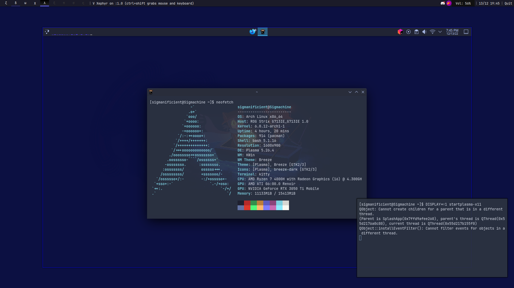

# Dotfiles

*Configuration files for my GNU/Linux system.*

I currently use `Qtile` as my Desktop Environment, but I am still configuring it.

So, for now, I have a side configuration for `KDE Plasma`.
I use `KDE` in a Xephyr window when necessary, but I use `Qtile` in the main screen.

## Organization

All configuration files are stored in the `src` directory.

It contains 4 subdirectories:

- `apps` contains configuration files for applications.
- `desktop` contains configuration files for the desktop environment.
- `extra` contains configuration files for other things.
- `themes` contains configuration files for themes (like gtk).

You can also find extra configuration files in the `src/extra` directory.

## Tools I use

- OS: [GNU](https://www.gnu.org/home.en.html)/[Linux](https://en.wikipedia.org/wiki/Linux)
- Distribution: [Arch](https://archlinux.org)
- Desktop Environment: [Qtile](http://www.qtile.org), [KDE Plasma](https://kde.org/plasma-desktop)
- Terminal Emulator: [Kitty](https://sw.kovidgoyal.net/kitty)
- Shell: [Bash](https://www.gnu.org/software/bash)

### Dev

- Jetbrains IDE Suite:
[PyCharm](https://www.jetbrains.com/pycharm), 
[CLion](https://www.jetbrains.com/clion),
[DataGrip](https://www.jetbrains.com/datagrip)
[PhpStorm](https://www.jetbrains.com/phpstorm) 
& [WebStorm](https://www.jetbrains.com/webstorm)
- Lighter TUI Editor: [Emacs](https://www.gnu.org/software/emacs)
- Text Editor: [Sublime Text](https://www.sublimetext.com)

I am planning to use [Neovim](https://www.vim.org) in the future.

### Utilities

- TUI File manager: [Ranger](https://ranger.github.io)
- Resource monitor: [Bpytop](https://github.com/aristocratos/bpytop)
- screenshot tool: [Flameshot](https://flameshot.org)
- Wallpaper manager: [Nitrogen](https://github.com/l3ib/nitrogen)
