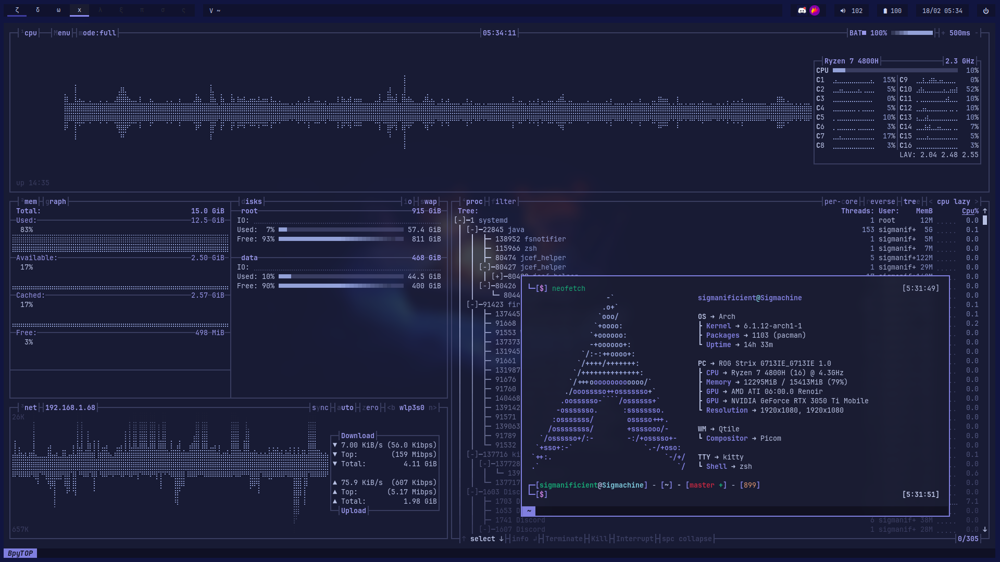
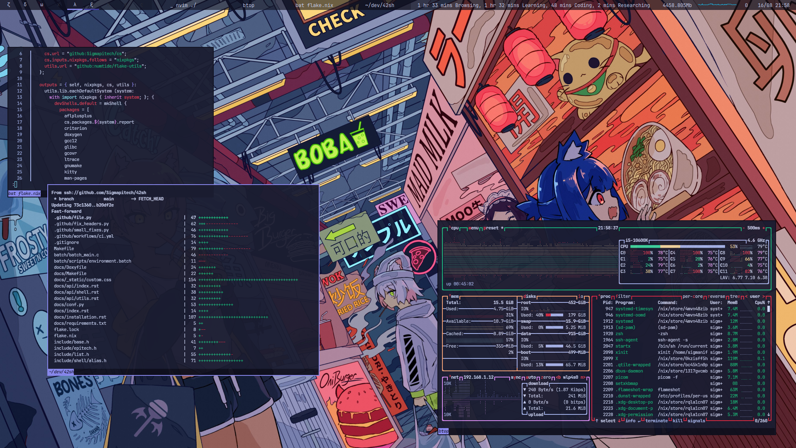
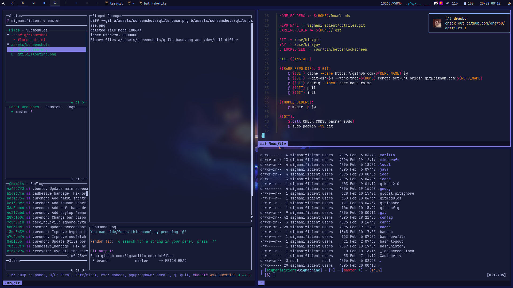
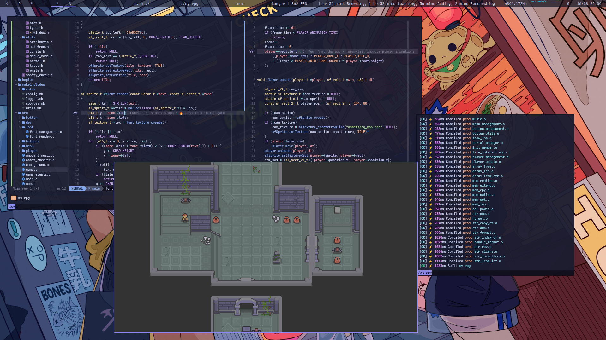

<div align="center">


# ❖ Sigma's Dotfiles ❖

  

*Configuration files for my GNU+Linux system.*

#


</div>

## :wrench: <samp>INSTALLATION</samp>

### :paperclip: <samp>Standard</samp>

> **Warning**
> Some additional configuration may be required

<kbd>I.</kbd> Clone the repository

> **Note**
> I personally clone the repository as my home[^clone_as_home].
```bash
git clone https://github.com/Sigmanificient/dotfiles.git --recurse-submodules
cd dotfiles
```

<kbd>II.</kbd> Copy the configuration
```bash
cp -r .* ~
```

### :cherry_blossom: <samp>Nix</samp>

Copy the flake config

```bash
cp flake* ~
```

> Note: Don't forget to edit the appropriate settings such as username & hardware configuration
> You can use `cp /etc/nixos/hardware-configuration.nix .config/nixos/hardware-configuration.nix`

```
sudo nixos-rebuild switch --flake '.'
```

> **Warning**
> I do not use a display manager, use `startx`
> or setup your own display manager

## :bookmark_tabs: <samp>DETAILS</samp>



- Linux Kernel: [Xanmod](https://xanmod.org/)
- Desktop Environment: [Qtile](http://www.qtile.org)
- Terminal Emulator: [Kitty](https://sw.kovidgoyal.net/kitty)
- Shell: [Zsh](https://www.zsh.org/) with [Oh my Zsh](https://ohmyz.sh/)
- Compositor: [Picom](https://github.com/yshui/picom)
- Notifier: [dunst](https://dunst-project.org)

### <samp>Dev</samp>


- Jetbrains IDE Suite: [PyCharm](https://www.jetbrains.com/pycharm), [CLion](https://www.jetbrains.com/clion), ...
- GUI Text Editor: [Sublime Text](https://www.sublimetext.com)
- TUI Commit Helper: [Lazygit](https://github.com/jesseduffield/lazygit)

### <samp>Other Utilities</samp>

- TUI File manager: [Ranger](https://ranger.github.io)
- GUI File manager: [Thunar](https://docs.xfce.org/xfce/thunar/start)
- Resource monitor: [Bpytop](https://github.com/aristocratos/bpytop)
- screenshot tool: [Flameshot](https://flameshot.org)



## :art: <samp>Colors</samp>

<table align="right">
  <tr>
    <td align="center">
      <samp>
        This color scheme is inspired from
        <a href="https://github.com/catppuccin/catppuccin">Catppuccin Mocha</a>
      </samp>
    </td>
  </tr>
</table>


| Black    | Red      | Green    | Yellow   | Blue     | Magenta  | Cyan     | White    |
|----------|----------|----------|----------|----------|----------|----------|----------|
| `0F0F1C` | `D22942` | `17B67C` | `F2A174` | `8B8AF1` | `D78AF1` | `4FCFEB` | `B4C0EC` |
| `1A1C31` | `DE4259` | `3FD7A0` | `EEC09F` | `A7A5FB` | `E5A5FB` | `82E3F8` | `CAD3F5` |



[^clone_as_home]:
    Cloning as the home directory
    <br>
    <kbd>I.</kbd> Bare Clone
    ```bash
    git clone --bare https://github.com/Sigmanificient/dotfiles.git $HOME/.git
    git --git-dir=$HOME/.git --work-tree=$HOME remote set-url origin git@github.com:Sigmanificient/dotfiles
    git config --local core.bare false
    ```
    <kbd>II.</kbd> Update
    ```bash
    git reset --hard HEAD
    git pull --rebase
    ```
    <kbd>III.</kbd> Submodules
    ```bash
    git submodule init
    git submodule update --init --force
    ```
    <kbd>IV.</kbd> Fix history
    ```bash
    git clone https://github.com/Sigmanificient/dotfiles.git tmp
    cp tmp/.git ~ -r
    git add .
    ```

<div align="center">
    
</div>
