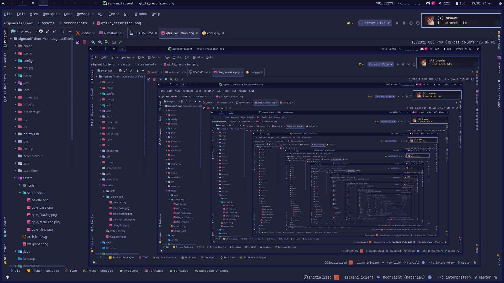
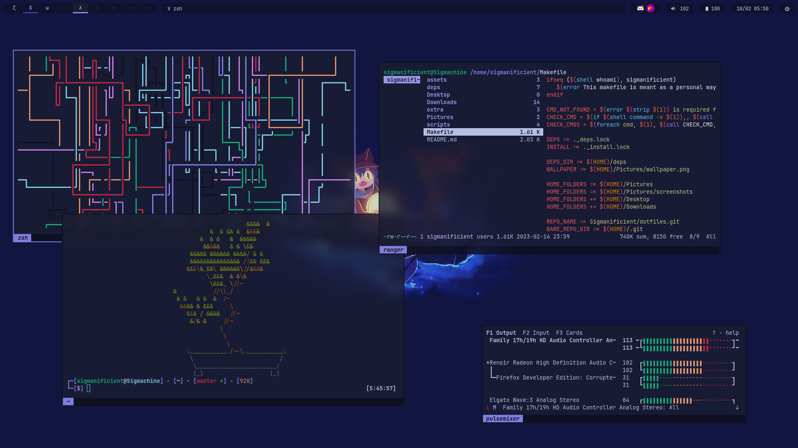

# Dotfiles

*Configuration files for my GNU/Linux system.*

I currently use `Qtile` as my Desktop Environment, but I am still configuring it.

> Install of nixos

```
sudo nixos-rebuild switch --flake '.'
```

## Some nice screenshots






## Color palette

> tty


| Black    | Red      | Green    | Yellow   | Blue     | Magenta  | Cyan     | White    |
|----------|----------|----------|----------|----------|----------|----------|----------|
| `0F0F1C` | `D22942` | `17B67C` | `F2A174` | `8B8AF1` | `D78AF1` | `4FCFEB` | `B4C0EC` |
| `1A1C31` | `DE4259` | `3FD7A0` | `EEC09F` | `A7A5FB` | `E5A5FB` | `82E3F8` | `CAD3F5` |

## Tools I use

- OS: [GNU](https://www.gnu.org/home.en.html)/[Linux](https://en.wikipedia.org/wiki/Linux)
- Distribution: [Arch](https://archlinux.org)
- Desktop Environment: [Qtile](http://www.qtile.org)
- Terminal Emulator: [Kitty](https://sw.kovidgoyal.net/kitty)
- Shell: [Bash](https://www.gnu.org/software/bash)

### Dev

- Jetbrains IDE Suite:
[PyCharm](https://www.jetbrains.com/pycharm), 
[CLion](https://www.jetbrains.com/clion),
[DataGrip](https://www.jetbrains.com/datagrip)
[PhpStorm](https://www.jetbrains.com/phpstorm) 
& [WebStorm](https://www.jetbrains.com/webstorm)
- Lighter TUI Editor: [Emacs](https://www.gnu.org/software/emacs)
- Text Editor: [Sublime Text](https://www.sublimetext.com)

I am planning to use [Neovim](https://www.vim.org) in the future.

### Utilities

- TUI File manager: [Ranger](https://ranger.github.io)
- Resource monitor: [Bpytop](https://github.com/aristocratos/bpytop)
- screenshot tool: [Flameshot](https://flameshot.org)
- Wallpaper manager: [Nitrogen](https://github.com/l3ib/nitrogen)
