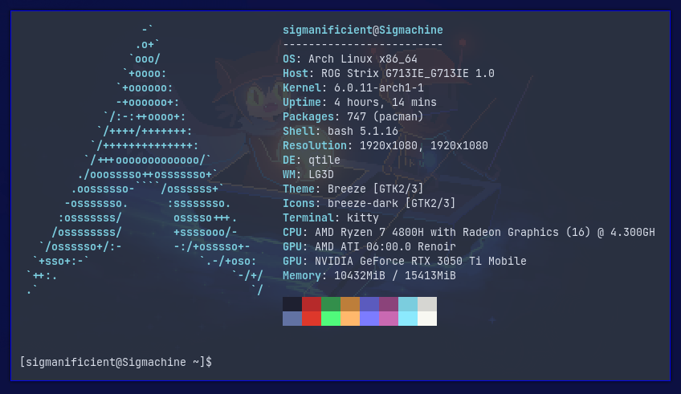

# Dotfiles

*Configuration files for my GNU/Linux system.*

> My [neofetch](https://github.com/dylanaraps/neofetch)

## Tools I use

- OS: [GNU](https://www.gnu.org/home.en.html)/[Linux](https://en.wikipedia.org/wiki/Linux)
- Distribution: [Arch](https://archlinux.org)
- Window Manager powered by python: [Qtile](http://www.qtile.org)
- Terminal Emulator: [Kitty](https://sw.kovidgoyal.net/kitty)

### Dev

- Jetbrains IDE Suite:
[PyCharm](https://www.jetbrains.com/pycharm), 
[CLion](https://www.jetbrains.com/clion),
[DataGrip](https://www.jetbrains.com/datagrip)
[PhpStorm](https://www.jetbrains.com/phpstorm) 
& [WebStorm](https://www.jetbrains.com/webstorm)
- Lighter TUI Editor: [Emacs](https://www.gnu.org/software/emacs)

### Utilities

- TUI File manager: [Ranger](https://ranger.github.io)
- Resource monitor: [Bpytop](https://github.com/aristocratos/bpytop)
- screenshot tool: [Flameshot](https://flameshot.org)
- Wallpaper manager: [Nitrogen](https://github.com/l3ib/nitrogen)
